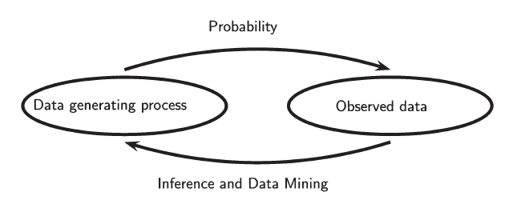

.center[

# Week 2 Announcements

]

--
### Don't forget about post-class reflections

--

### The weekly writing assignments (i.e., reflections and class prep) do not need to follow the provided templates

--
### General comments about grades
* Problems sets can be revised
* My goal is for you to reach your goals. The assignments are designed with that in mind
  * If you want to modify a course assignment to a dataset you work with, we can do that!

--

### I will try to post slides before class, but we will be adding to them as we go along. The .rmd and .pdf files will be available at the course GitHub repo.


---

.center[
# More Week 2 Announcements
]

### A note about course material organization
* I do know that we could be using Canvas for organizing materials
* Tools like Google Drive, Slack, and GitHub are common in practice
* I want you all to be familiar and comfortable with these tools by the end of the semester 
* Consider this a low-stakes opportunity to learn even more new tools (yay!)

--

### A note about programming
* I certainly recognize programming may be unfamiliar to some students
* I will try to post resources (e.g., video tutorials) to help you get started
* Never hesitate to reach out to your classmates or me if you need help!
* There _are_ options we can use if programming isn't your jam


---

.center[
# Week 2 Reading Assignment
]

.pull-left[
## DSUR - Chapter 1:  
Why is my evil lecturer forcing me to learn statistics
]

.pull-right[
## DSUR - Chatper 2: 
Everything you ever wanted to know about statistics
]

<br>
## R4DS - Sections 1 - 8

---


# Today's Plan

### Refresh of some ideas from Fall research methods

### 

---

# Reviewing Prior Knowledge (1/4)

### Q: When we think about research - _building knowledge_ - when and how do quantitative methods fit in?


---


# Reviewing Prior Knowledge (2/4)

### Q: What worldviews or paradigms are generally associated with quantitative methods?


---


# Reviewing Prior Knowledge (3/4)

### Q: What research quality words do we generally associate with quantitative methods?


---


# Reviewing Prior Knowledge (4/4)

### Q: What study designs do we generally associated with quantitative methods?


---

class: inverse, middle, center


# Chapter One

### Why is My Evil Lecturer Forcing Me to Learn Statistics?


---

class: center, middle

# Main Takeaways


---

# $\S$ 1.1-1.4 

### Much of this should sound familiar from last semester
* These ideas are important, especially around falsification
* We will not be discussing them too much in class
* You can consider these part of the "philosophy" track of the class


---

# $\S$ 1.5 Data Collection

## Variables

.pull-left[

### Independent/Dependent Variables

* Independent and dependent variables

* Predictor and outcome variable

* Covariates and target

* Explanatory and response variable

]

--


.pull-right[

### Levels of Measurement

* Categorial Variable
  * **Nominal**
  * **Ordinal**

* Continuous variable
  * **Interval**
  * **Ratio**

]


---

.center[
# Measurement Error
]

* What does this look like in education settings? </br>


--

* What kinds of measurements are we taking?


---

.center[
# Validity and Reliability
]

.pull-left[

### Validity
* Content validity

* Criterion validity

  * Concurrent

  * Predictive

* Construct validity

* Face validity

]


--

.pull-right[

### Reliability

* Inter-rater reliability 

* Intra-rater reliability

* Test-retest reliability

* Split-half reliability

]


---


class: center, middle

# Common Distributions

---

.center[
# Normal Distribution
]

.center[
In general, the notation for a normal distribution for a random variable with mean $\mu$ and standard deviation $\sigma$ looks like this: <br>

$x \sim \mathcal{N} (\mu, \,\sigma^{2})$ 
or something more specific like $x \sim \mathcal{N} (0, \,1)$

]

--

.pull-left[
```{r normal-hist, echo = FALSE}
x <- rnorm(n = 10000, sd = 1, mean = 0)

hist(x)


```
]

--

.pull-right[

```{r normal-geom_histogram}

x_df <- as_tibble(x)
ggplot(data = x_df, mapping = aes(x = x)) +
  geom_histogram()


```

]


---

.center[

# Binomial distribution

.left[The binomial distribution can be used to characterize a binary random variable $n$ trials of probability of success $p$ for each trial. <br>
Such a variable is denoted as: $x \sim \mathcal{Bin}(n, \,p)$

]
]

--

.pull-left[


]

--

.pull-right[


]

---

.center[

# Chapter One Vocabulary

]

.pull-left[

Multimodal <br>
Negative skew <br>
Nominal variable <br>
Normal distribution <br>
Null hypothesis <br>
Ordinal variable <br>
Outcome variable <br>
Platykurtic <br>
Positive skew <br>
Practice effect <br>
Predictor variable <br>
Probability distribution <br>
Qualitative methods <br>
Quantitative methods <br>
Quartile <br>
Randomization <br>


]


.pull-right[

Range <br>
Ratio variable <br>
Reliability <br>
Repeated-measures design <br>
Second quartile <br>
Skew <br>
Systematic variation <br>
_Tertium quid_ <br>
Test-retest reliability <br>
Theory <br>
Unsystematic variation <br>
Upper quartile <br>
Validity <br>
Variables <br>
Within-subject design <br>
z-scores

]


---
class: inverse, middle, center

# Chapter Two

Everything You Ever Wanted to Know About Statistics


---

# Main takeaways


---

.center[

# General Philosophy
]


.middle[



]

---


.center[

# Chapter Two Vocabulary

]

.pull-left[

$\alpha$-level <br>
$\beta$-level <br>
Central limit theorem <br>
Confidence interval <br>
Degrees of freedom <br>
Deviance <br>
Effect size <br>
Fit <br>
Linear model <br>
Meta-analysis <br>
One-tailed test <br>
Population <br>
Power <br>


]


.pull-right[

Sample <br>
Sampling distribution <br>
Sampling variation <br>
Standard deviation <br>
Standard error <br>
Standard error of the mean (SE) <br>
Sum of squared errors (SSE) <br>
Test statistic <br>
Two-tailed test <br>
Type I error <br>
Type II error <br>
Variance

]


---
class: center, middle, inverse

#R for Data Science


---

.center[

# General Impressions?

]

---

.center[

# General Philosophy

.middle[


]

]


---

.center[

# Introduction

]

---

.center[

# $\S$ 3 Data Visualization

]

---

.center[

# $\S$ 4 Workflow: Basics

]

---

.center[

# $\S$ 5 Data Transformation

]

---

.center[

# $\S$ 6 Workflow: Scripts

]

---

.center[

# $\S$ 7 Exploratory Data Analysis
]

---

.center[

# $\S$ 8 Workflow: Projects

]


